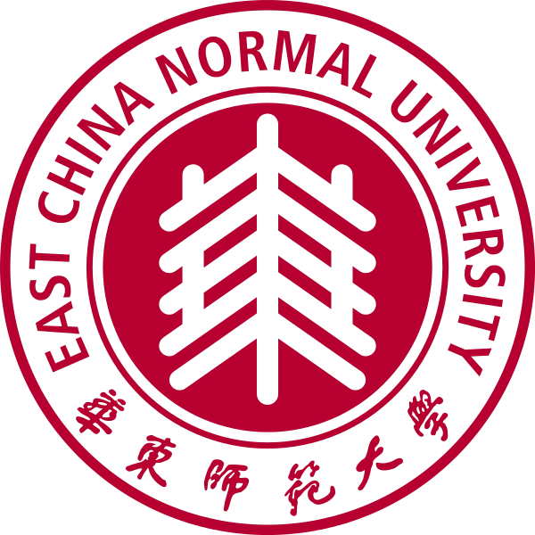

# 千禧年个人名片网页

一个使用原生 HTML、CSS 和 JavaScript 制作的个人主页与作品集，用于展示个人信息、技能方向、项目、交流与获奖经历。页面默认深色科技风，支持中英文首页、项目横向轮播、独立项目详情页、浅色模式、响应式布局、移动端菜单、导航高亮、进入视口动画和复制邮箱功能。

## 文件结构

```text
.
├── index.html   # 页面结构与内容
├── en.html      # 英文版页面
├── project-lulc.html              # LULC 项目详情页
├── project-geochef.html           # GeoChef 项目详情页
├── project-map-adventure.html     # 地图冒险游戏详情页
├── project-uav.html               # 无人机项目预留页
├── project-rs-interpretation.html # 遥感解译项目预留页
├── project-card-checkers.html     # 卡牌跳棋项目预留页
├── en-project-*.html              # 对应的英文项目详情页与预留页
├── assets/                        # 项目卡片与详情页图片（含 LULC、GeoChef、地图冒险真实成果图）
├── style.css    # 视觉样式、响应式布局、主题变量
├── script.js    # 主题、菜单、轮播、滚动高亮、复制邮箱等交互
└── README.md    # 项目说明
```

## 本地运行方式

方式一：直接双击 `index.html`，用浏览器打开。

方式二：在项目目录启动本地静态服务器：

```powershell
python -m http.server 8000
```

然后访问：

```text
http://localhost:8000
```

## 修改内容

### 修改校徽或头像

当前中英文首屏默认使用 `assets/ecnu-emblem.png`。在 `index.html` 和 `en.html` 中找到 `.avatar` 图片：

```html

```

把 `src` 改成你的头像文件路径，例如：

```html

```

### 修改姓名和身份

在 `index.html` 首屏区域修改：

```html
<h1 id="hero-title">郭书良</h1>
<p class="name-line"><span>你也可以叫我</span><strong>千禧年</strong></p>
<p class="identity">华东师范大学空间人工智能学院本科生</p>
```

### 修改项目

在 `index.html` 和 `en.html` 中搜索 `project-card`，按卡片结构替换项目名称、简介、技术栈和链接。每个卡片的 `href` 指向对应项目详情页。

完整项目页目前为：

- `project-lulc.html`
- `project-geochef.html`
- `project-map-adventure.html`

其余三个页面为预留结构，获得真实项目资料后再补充，避免展示未经确认的信息。

LULC 项目页已接入真实实验信息，内容包括华东师大闵行校区 10 m 四波段影像、ENVI 最大似然分类、Python 对象级空间规则后处理、35 个有效评价样点以及 SinoLC-1 / FinalV3 精度对比。项目卡片和详情页使用：

- `assets/lulc-classification-comparison.png`
- `assets/lulc-accuracy-comparison.png`

GeoChef 和地图冒险项目页已接入真实界面素材：

- `assets/geochef-home.png`、`assets/geochef-filter.png`、`assets/geochef-leakage.png`
- `assets/map-adventure-map.png`、`assets/map-adventure-event.png`、`assets/map-adventure-combat.png`、`assets/map-adventure-collectibles.png`

### 修改项目图片

项目图片位于 `assets/`。可以直接替换同名 SVG，也可以将卡片和详情页中的 `src` 改为新的 JPG、PNG 或 WebP 文件。建议使用 16:9 图片，并同步修改 `alt` 文本。

### 修改联系方式

在 `index.html` 联系方式区域修改邮箱、GitHub 和个人主页链接：

```html
<a id="email-link" href="mailto:10251510463@stu.ecnu.edu.cn">10251510463@stu.ecnu.edu.cn</a>
<button class="btn btn-primary copy-email" type="button" data-email="10251510463@stu.ecnu.edu.cn">复制邮箱</button>
```

注意：邮箱文本和 `data-email` 都要一起改，复制功能才会使用新邮箱。

## 部署到 GitHub Pages

1. 新建 GitHub 仓库 `HUASHANGLIUSU.github.io`，并把本项目文件提交到仓库根目录。
2. 进入仓库的 `Settings`。
3. 打开 `Pages`。
4. 在 `Build and deployment` 中选择 `Deploy from a branch`。
5. 分支选择 `main`，目录选择 `/root`。
6. 保存后等待部署完成，个人主页地址为 `https://HUASHANGLIUSU.github.io/`。

## 质量说明

- 不依赖 React、Vue 或第三方 JavaScript 库。
- 支持直接打开 `index.html`，也支持本地静态服务器运行。
- 使用语义化 HTML，图片包含 `alt`，按钮和链接包含键盘焦点样式。
- 支持 `prefers-reduced-motion`，用户关闭动画时会减少动画效果。
- 项目轮播支持按钮、触控板、鼠标滚轮横向操作与键盘聚焦；用户交互时会暂停自动播放。
- 轮播提供独立暂停/继续按钮，并在系统开启“减少动态效果”时停用自动播放。
- LULC 项目中的 Python 部分表述为“对象级空间规则后处理”，不将其误称为重新训练的深度学习模型。
